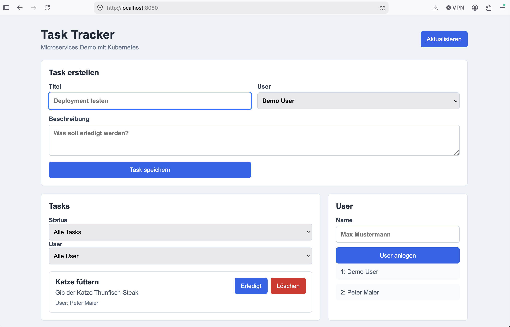

# Task Tracker Microservices Dokumentation

GitHub Repository: <https://github.com/PhilippTi218/TaskTracker>

Stand: 11. Juni 2026

## 1. Projektüberblick

Der Task Tracker ist eine einfache Microservices-Anwendung zur Verwaltung von Aufgaben und
Usern. Die Anwendung besteht aus einem statischen Frontend, zwei Flask-Backends und einer
PostgreSQL-Datenbank. Ziel des Projekts ist es, eine containerisierte Anwendung mit Docker Compose
lokal zu starten und zusätzlich Kubernetes-Ressourcen für Deployment, Service-Kommunikation,
Ingress, Konfiguration, Secrets, persistente Datenhaltung und Autoscaling bereitzustellen.

## 2. Screenshot



## 3. Architektur

Die Anwendung ist in vier zentrale Komponenten aufgeteilt:

- `frontend`: Statische Weboberfläche, ausgeliefert über Nginx. Nginx dient zusätzlich als
  Reverse Proxy für die Backend-APIs.
- `task-service`: Flask REST API für Tasks. Der Service verwaltet Titel, Beschreibung,
  User-Zuordnung und Erledigt-Status. Im Container wird der Service mit Gunicorn gestartet.
- `user-service`: Flask REST API für User. Der Service verwaltet Usernamen und validiert Eingaben.
  Im Container wird der Service mit Gunicorn gestartet.
- `postgres`: Gemeinsame PostgreSQL-Datenbank für Tasks und User.

Die Kommunikation läuft im lokalen Docker-Compose-Setup über interne Servicenamen. Das Frontend
ist über `http://localhost:8080` erreichbar und leitet API-Anfragen an die jeweiligen Backend-
Services weiter.

Die Flask-Backends laufen in den Docker-Containern nicht über den Flask Development Server,
sondern über Gunicorn:

```bash
gunicorn -b 0.0.0.0:5000 app:app
```

Vor dem Start wird jeweils die Datenbankinitialisierung ausgeführt.

## 4. Lokaler Start

Das Projekt kann lokal mit Docker Compose gebaut und gestartet werden:

```bash
docker compose up --build
```

Nach dem Start ist die Anwendung erreichbar unter:

```text
http://localhost:8080
```

Die direkt veröffentlichten Ports sind:

- Frontend: `8080`
- Task-Service: `5001`
- User-Service: `5002`
- PostgreSQL: `5432`

## 5. API-Funktionen

Der `task-service` stellt folgende Endpunkte bereit:

- `GET /tasks`
- `POST /tasks`
- `PATCH /tasks/<id>`
- `DELETE /tasks/<id>`

Die Task-Liste unterstützt Backend-Filter über Query-Parameter:

- `GET /tasks?done=true`
- `GET /tasks?done=false`
- `GET /tasks?user_id=1`
- `GET /tasks?user_id=1&done=true`

Der `user-service` stellt folgende Endpunkte bereit:

- `GET /users`
- `POST /users`

Beide Backend-Services besitzen einen Healthcheck unter `/health`. Dabei wird nicht nur geprüft,
ob Flask antwortet, sondern auch, ob eine Verbindung zur PostgreSQL-Datenbank möglich ist.

## 6. Validierung und Fehlerbehandlung

Beim Erstellen und Ändern von Tasks gelten folgende Regeln:

- `title` darf nicht leer sein.
- `done` muss ein boolescher Wert sein.
- `user_id` muss eine Zahl oder `null` sein.

Beim Erstellen von Usern gelten folgende Regeln:

- `name` muss ein String sein.
- `name` darf nicht leer sein.
- `name` darf maximal 80 Zeichen lang sein.
- Usernamen sind eindeutig; doppelte Namen werden mit `409 Conflict` abgelehnt.

Ungültige Eingaben werden mit passenden HTTP-Statuscodes und JSON-Fehlermeldungen beantwortet.

## 7. Datenbank und Persistenz

PostgreSQL speichert die Daten für Tasks und User. Im Docker-Compose-Setup wird dafür ein
Docker Volume verwendet. In Kubernetes wird PostgreSQL als `StatefulSet` mit einem
PersistentVolumeClaim (`PVC`) betrieben, damit Daten über Pod-Neustarts hinweg erhalten bleiben.

Die Datenbankkonfiguration liegt in Kubernetes in einer `ConfigMap`; das Datenbankpasswort liegt
in einem `Secret`. Die Services lesen diese Werte über Umgebungsvariablen ein.

## 8. Kubernetes-Ressourcen

Das Projekt enthält Kubernetes-Manifeste für:

- Namespace
- ConfigMap
- Secret
- PostgreSQL mit PVC und StatefulSet
- Task-Service Deployment und Service
- User-Service Deployment und Service
- Frontend Deployment und Service
- Ingress
- Horizontal Pod Autoscaler für den Task-Service

Die Ressourcen können mit folgendem Befehl angewendet werden:

```bash
kubectl apply -f k8s/
```

Wenn kein Ingress Controller aktiv ist, kann das Frontend per Port-Forward geöffnet werden:

```bash
kubectl port-forward -n task-tracker svc/frontend 8080:80
```

## 9. Automatisierte Tests

Für die Backend-APIs gibt es automatisierte Tests mit `pytest`. Die Tests prüfen zentrale
API-Fälle wie Filterlogik, Validierung, Healthchecks und Fehlerbehandlung. Die Datenbankverbindung
wird in den Tests gemockt, deshalb ist für die Testausführung keine laufende PostgreSQL-Instanz
notwendig.

Installation der Testabhängigkeiten:

```bash
pip install -r requirements-dev.txt
```

Tests ausführen:

```bash
python -m pytest
```

Aktueller Teststand:

```text
10 passed
```

## 10. Projektaufteilung

- Edwin Caballero: `frontend`, `frontend/Dockerfile`, Kubernetes Ingress/Frontend-Service
- Nadine Schmid: `task-service`, Task API, Task Deployment
- Philipp Tichy: `user-service`, PostgreSQL-StatefulSet, Secret, PVC

## 11. Fazit

Das Projekt demonstriert eine kleine, aber vollständige Microservices-Anwendung mit Docker,
Kubernetes und PostgreSQL. Neben der lokalen Ausführung mit Docker Compose enthält es Kubernetes-
Manifeste für Betrieb, Konfiguration, persistente Datenhaltung und optionales Autoscaling.
Durch Healthchecks, Eingabevalidierung und automatisierte Tests ist die Anwendung für eine Demonstration gut nachvollziehbar und überprüfbar.
