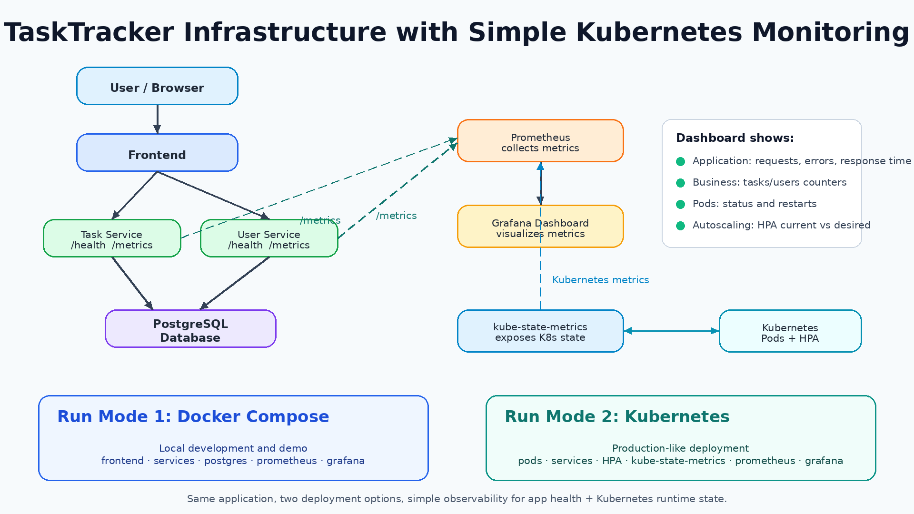
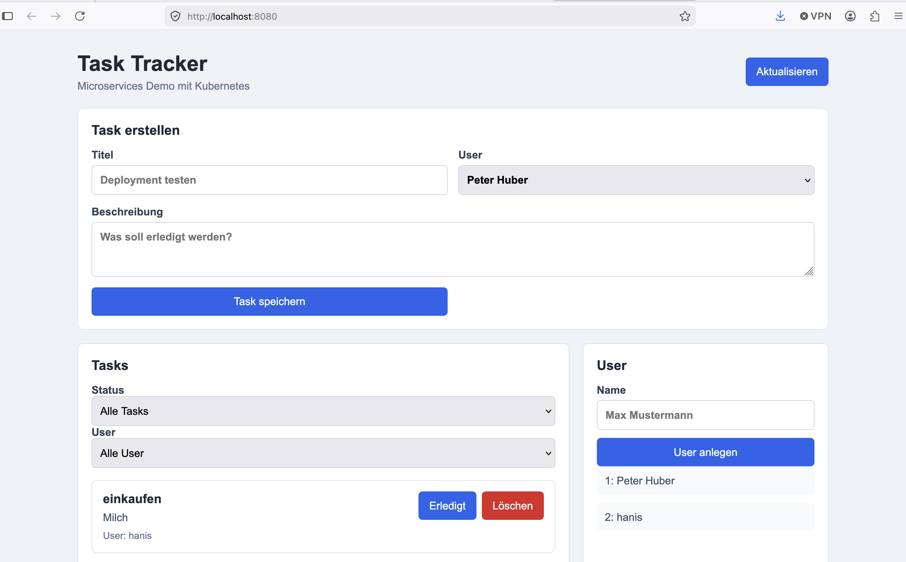
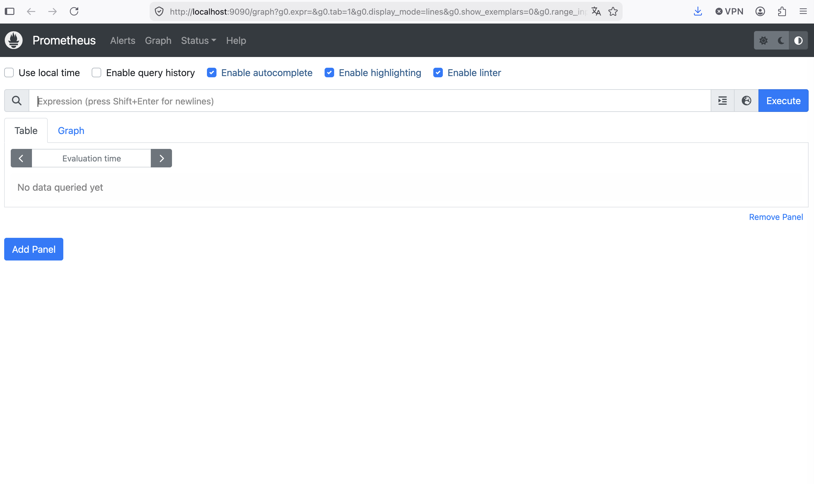
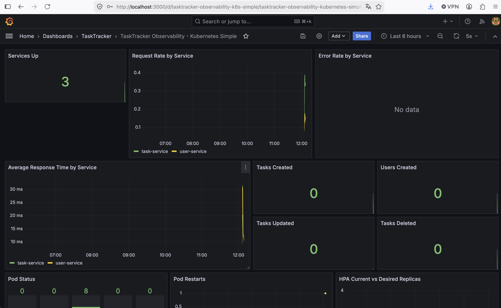

# TaskTracker Observability Extension

GitHub Repository: https://github.com/PhilippTi218/TaskTracker

## Teammitglieder

| Name            | Schwerpunkte in der Präsentation                               |
|-----------------|----------------------------------------------------------------|
| Philipp Tichy   | Ausgangssystem, Problemstellung und ursprüngliche Architektur  |
| Nadine Schmid   | Observability-Architektur mit Prometheus, Grafana und Metriken |
| Edwin Caballero | Kubernetes-Deployment, Demo und Laufzeit-Monitoring            |

## Titel des Themas

**Erweiterung der TaskTracker-Architektur um Observability mit Prometheus, Grafana und Kubernetes-Monitoring**

## Ziel der Erweiterung

TaskTracker war bereits eine containerisierte Anwendung mit Frontend, Task-Service, User-Service, PostgreSQL und Kubernetes-Deployment. Ziel der Erweiterung war es, diese bestehende Architektur beobachtbar zu machen.

Dafür wurden die Backend-Services um Prometheus-kompatible `/metrics`-Endpunkte erweitert. Prometheus sammelt technische und fachliche Metriken, Grafana visualisiert diese Metriken in Dashboards. Zusätzlich wurde `kube-state-metrics` ergänzt, damit auch Kubernetes-Zustände wie Pod-Status, Pod-Restarts und HPA-Replikas beobachtet werden können.

## Einfaches Komponentendiagramm



Kurz erklärt:

- Benutzer greifen über das Frontend auf die Anwendung zu.
- Das Frontend kommuniziert mit `task-service` und `user-service`.
- Beide Backend-Services verwenden PostgreSQL zur Persistenz.
- Beide Backend-Services stellen `/health` und `/metrics` bereit.
- Prometheus sammelt Metriken von den Services und von `kube-state-metrics`.
- Grafana nutzt Prometheus als Datenquelle und zeigt die Werte in Dashboards an.

## Ergebnisse als Screenshots

Die folgenden Screenshots sollen die wichtigsten Ergebnisse der Erweiterung dokumentieren:

### 1. Frontend

Screenshot der laufenden TaskTracker-Weboberfläche unter:

```text
http://localhost:8080
```



### 2. Prometheus Targets oder Query

Screenshot von Prometheus unter:

```text
http://localhost:9090
```



### 3. Grafana Dashboard

Screenshot von Grafana unter:

```text
http://localhost:3000
```

Login:

```text
admin / password!1
```



## Ergebnis

Die Erweiterung macht die TaskTracker-Anwendung besser überwachbar. Vorher konnte man über Health Checks nur erkennen, ob ein Service aktuell erreichbar ist. Mit Prometheus und Grafana können nun auch Metriken über Zeit betrachtet werden, zum Beispiel Request-Anzahl, Fehlerrate, Antwortzeit und fachliche Ereignisse wie erstellte Tasks oder User.

Durch `kube-state-metrics` ist außerdem sichtbar, wie sich die Anwendung in Kubernetes verhält. Dadurch können Pod-Zustände, Neustarts und HPA-Replikas im Grafana-Dashboard beobachtet werden. Das Ergebnis ist eine kompakte, verständliche Observability-Erweiterung für eine bereits containerisierte und Kubernetes-fähige Microservice-Anwendung.

## Verwendete Metriken

### Technische Metriken

```text
up
flask_http_request_total
flask_http_request_duration_seconds
```

### Business-Metriken

```text
tasktracker_tasks_created_total
tasktracker_tasks_updated_total
tasktracker_tasks_deleted_total
tasktracker_users_created_total
```

### Kubernetes-Metriken

```text
kube_pod_status_phase
kube_pod_container_status_restarts_total
kube_horizontalpodautoscaler_status_current_replicas
kube_horizontalpodautoscaler_status_desired_replicas
```
